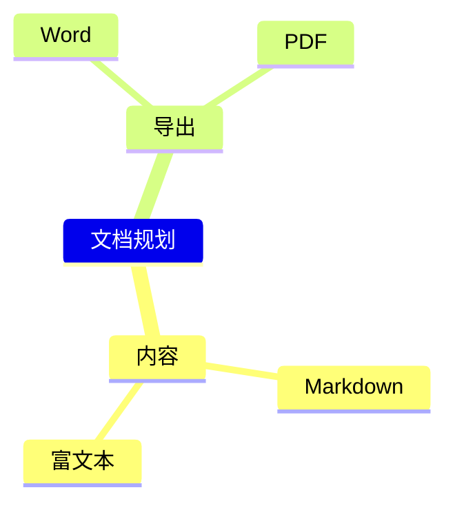

# 文档一致性与思维导图

预览、Markdown 转富文本、Word 和 PDF 使用同一份 markdown-it 解析结果。保留标题层级、软换行、嵌套列表、复选框、引用、表格、链接、图片，以及代码语言和语法颜色。Word 中表格与文字可编辑；PDF 按纸张分页，因此换行和页面位置可能与窗口预览不同。复制代码按钮属于界面操作，不写入导出文档。

富文本保存增加版本化结构信息，保留代码语言、表格位置与列表层级。旧 RTF/RTFD 文档继续可读。旧富文本此前已经丢失的结构无法自动推断；保留原 Markdown 的文档可重新切换为富文本获得完整格式。

## 思维导图

在正文左侧“＋”、格式工具栏或右下角“…”中选择“插入或编辑思维导图”。每行一个主题，Tab 增加缩进，Shift + Tab 减少缩进；右侧实时预览。选中富文本中的导图，或将光标放在 Markdown 导图代码块内，再打开此入口即可编辑原图。插入、替换和撤销通过文档原有编辑与保存流程完成。

Markdown 使用 Mermaid 的 mindmap 代码块；Zilo 离线支持主题、缩进层级和常用节点标签。支持 100 个主题、12 层。图标、样式指令与其他 Mermaid 图表类型暂不支持，错误会明确显示，转换时保留源码。语法参考 [Mermaid 官方文档](https://mermaid.js.org/syntax/mindmap.html)。

Word / PDF 中导图以清晰图片显示；Markdown 导出保留可编辑的 mindmap 源码。导图生成在本机完成，无需上传文档。

## 验证

使用同一份验收内容检查 Markdown 预览、富文本保存与重新打开、两种模式的 Word/PDF/Markdown 导出。新增回归检查覆盖软换行、嵌套列表、复选框、代码颜色与语言、可编辑表格、表情字体、思维导图层级与安全转义、编辑后恢复、无效导图保留源码。实际 Word 与 PDF 渲染逐页检查；安装版本使用原生界面确认。
